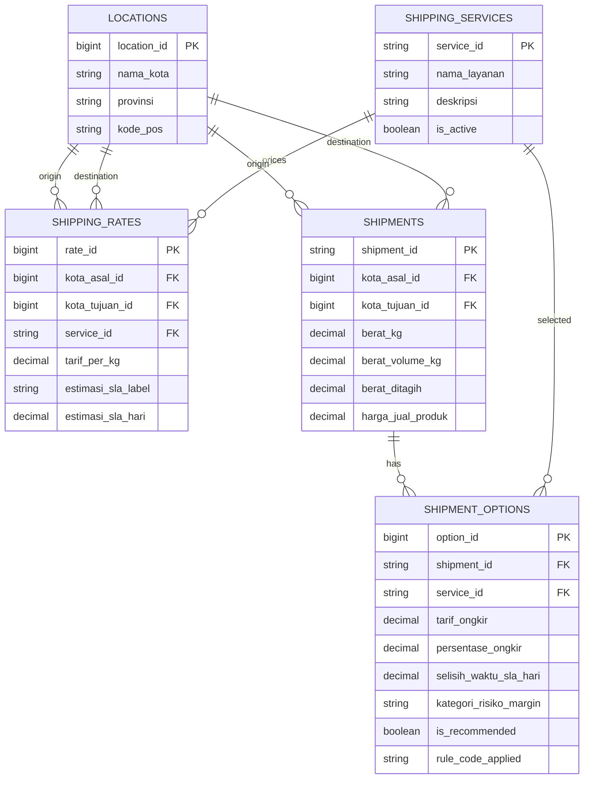

# Shipping Rate Calculator ERD

The API continues to accept city/province labels from the React form. Laravel resolves those labels to `locations.location_id`, then uses foreign keys for rate lookup and shipment history. PostgreSQL migrations under `backend/database/migrations` are authoritative for this diagram.