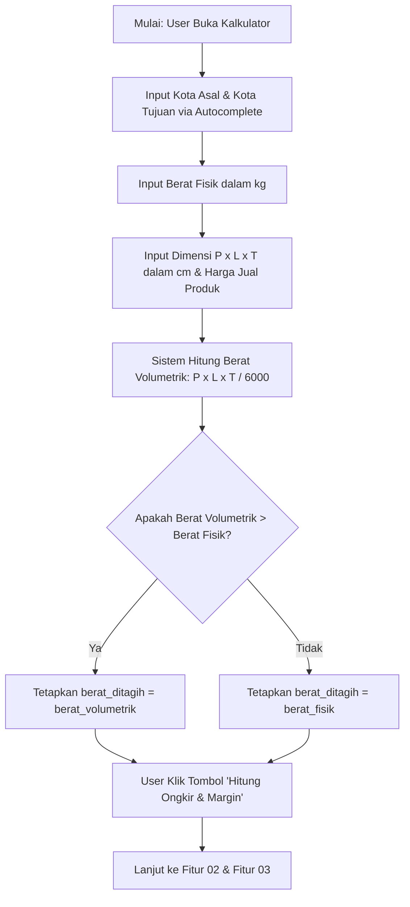

# Functional Requirements Document (FRD) v2
## Fitur 01: Form Input Pengiriman & Volumetrik
**Proyek**: Anteraja Shipping Rate Calculator Optimization (MVP 2-Bulan)

---

### 1 · Konteks
Fitur ini berfungsi sebagai gerbang utama bagi penjual UMKM untuk memasukkan parameter pengiriman (kota asal, kota tujuan, berat fisik, dimensi paket, dan harga jual barang) serta menghitung berat volumetrik secara otomatis. Fitur ini mengacu pada Bagian 4.A.1 dan Bagian 7 (P1 Must-Have) dalam `prd-shipping-rate-calculator-mvp-v3.md` untuk memangkas waktu analisis pengiriman dari 210 detik menjadi <10 detik.

---

### 2 · Peran & Hak Akses

| Peran Pengguna | Lihat | Buat / Input | Ubah Input | Setujui | Field Terkunci (Read-Only) | Dikonfirmasi Ke |
| :--- | :---: | :---: | :---: | :---: | :--- | :--- |
| **Penjual UMKM (Public User)** | Ya | Ya | Ya | N/A | `berat_volume_kg`, `berat_ditagih` (Auto-calculated) | Pemilik Proses |
| **Admin Pricing/Ops Anteraja** | Ya | Ya | Ya | Ya | N/A (Mengelola Master Data Rute & Tarif) | Pemilik Proses |

---

### 3 · Alur (Workflow)

---

### 4 · Aturan Bisnis (Business Rules)

| No. BR | Kondisi / Trigger | Hasil / Perhitungan | Pengecualian | Dikonfirmasi Ke |
| :--- | :--- | :--- | :--- | :--- |
| **BR-01** | Pengisian Dimensi ($P, L, T$) | $	ext{berat\_volume\_kg} = (P 	imes L 	imes T) / 6000$. Nilai $	ext{berat\_ditagih}$ diambil dari angka terbesar antara berat fisik dan berat volumetrik, dibulatkan ke atas per 1 kg. | Jika dimensi tidak diisi ($0$ atau kosong), maka $	ext{berat\_ditagih} = 	ext{berat\_fisik}$. | Pemilik Proses |
| **BR-02** | Validasi Rentang Input | - $	ext{berat\_kg}$: $0.1 - 50.0	ext{ kg}$ - Dimensi ($P,L,T$): $1 - 150	ext{ cm}$ - $	ext{harga\_jual\_produk}$: $	ext{Rp } 1.000 - 	ext{Rp } 100.000.000$ | Input di luar batas menampilkan pesan error inline tanpa mengosongkan form. | Pemilik Proses |
| **BR-03** | Autocomplete Rute | Kota asal & tujuan wajib dipilih dari database master rute Anteraja (Kecamatan/Kota). | Jika rute lokasi tidak ditemukan, sistem menampilkan pesan saran hubungi CS BisnisAja. | Pemilik Proses |

---

### 5 · Istilah (Glossary)

| Istilah Internal | Definisi & Arti Bisnis | Dikonfirmasi Ke |
| :--- | :--- | :--- |
| **Berat Volumetrik** | Bobot paket yang dihitung dari volume fisik berdasarkan standar logistik nasional $((P 	imes L 	imes T) / 6000)$. | User tiap peran |
| **Berat Ditagih (Billable Weight)** | Bobot acuan akhir yang digunakan untuk penentuan tarif ongkir (nilai tertinggi antara berat fisik vs volumetrik). | User tiap peran |

---

### 6 · Data Utama & Status

- **Daftar Field Utama**: `kota_asal`, `kota_tujuan`, `berat_kg`, `panjang_cm`, `lebar_cm`, `tinggi_cm`, `harga_jual_produk`, `berat_volume_kg`, `berat_ditagih`.
- **Status & Perpindahan State**:
  - `DRAFT_INPUT`: State awal saat pengguna sedang mengisi form input.
  - `VALIDATED`: Form terisi lengkap dan lulus aturan validasi rentang.
  - `CALCULATED`: Sistem selesai menghitung `berat_volume_kg` dan `berat_ditagih`.

---

### 7 · Daftar Fungsi

1. **`F-01.1 Input Autocomplete Lokasi`**: Menyediakan fitur pencarian cepat nama kecamatan/kota asal dan tujuan dengan pencocokan kata kunci.
2. **`F-01.2 Kalkulator Volumetrik Real-time`**: Menghitung nilai `berat_volume_kg` secara otomatis segera setelah dimensi P/L/T dimasukkan.
3. **`F-01.3 Validasi Parameter Input`**: Memeriksa kelengkapan form dan memastikan seluruh nilai berada dalam batas operasional logistik.

---

### 8 · Acceptance Criteria (AC) Alur Utama

- **Skenario Real**: Budi (Penjual Keripik di Bandung) ingin mengestimasi ongkir pengiriman paket ke Surabaya.
- **Langkah & Hasil**:
  1. Budi memilih Kota Asal "Bandung" dan Kota Tujuan "Surabaya" dari dropdown autocomplete.
  2. Budi memasukkan `berat_kg` = 0.5 kg, `panjang_cm` = 30 cm, `lebar_cm` = 20 cm, `tinggi_cm` = 20 cm, serta `harga_jual_produk` = Rp 50.000.
  3. Sistem secara otomatis menghitung `berat_volume_kg` = $(30 	imes 20 	imes 20) / 6000 = 2.0	ext{ kg}$.
  4. Sistem menetapkan `berat_ditagih` = 2.0 kg (karena volumetrik 2.0 kg > berat fisik 0.5 kg).
  5. Budi menekan tombol "Hitung Ongkir & Margin" dan sistem berhasil berpindah ke layar hasil perhitungan tanpa hambatan.

---

### 9 · Tidak Termasuk (Out of Scope)

- Pengisian lokasi otomatis berbasis GPS/Geolocation browser.
- Integrasi otomatis dengan timbangan digital terhubung USB/Bluetooth.
- Input pengiriman banyak lokasi sekaligus (*multi-origin* atau *multi-destination*).
