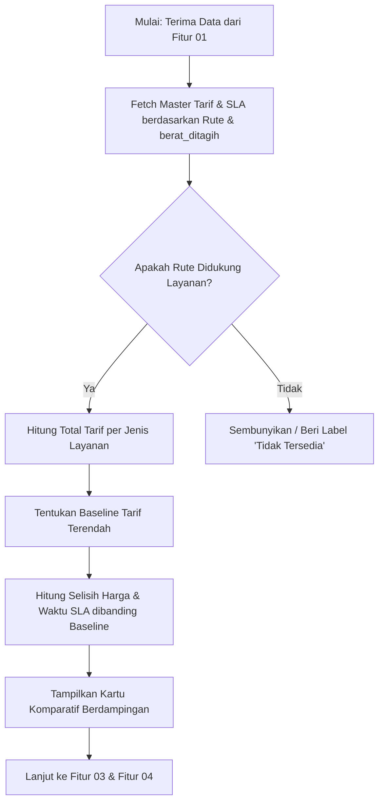

# Functional Requirements Document (FRD)
## Fitur 02: Perbandingan Layanan Berdampingan (Side-by-Side)
**Proyek**: Anteraja Shipping Rate Calculator Optimization (MVP 2-Bulan)

---

### 1 · Konteks
Fitur ini menampilkan seluruh opsi layanan pengiriman Anteraja (Reguler, Next Day, Same Day, Ekonomi) secara berdampingan dalam kartu komparatif. Fitur ini mengacu pada Bagian 4.A.2 dan Bagian 7 (P1 Must-Have) dalam `prd-shipping-rate-calculator-mvp-v3.md` untuk membantu penjual membandingkan tarif, SLA, dan selisih biaya secara efisien dalam satu layar.

---

### 2 · Peran & Hak Akses

| Peran Pengguna | Lihat | Buat / Input | Ubah Input | Setujui | Field Terkunci (Read-Only) | Dikonfirmasi Ke |
| :--- | :---: | :---: | :---: | :---: | :--- | :--- |
| **Penjual UMKM (Public User)** | Ya | N/A | N/A | N/A | `tarif_ongkir`, `estimasi_sla`, `selisih_harga_layanan` | Pemilik Proses |
| **Admin Pricing/Ops Anteraja** | Ya | Ya | Ya | Ya | N/A (Mengelola Master Data Tarif & SLA) | Pemilik Proses |

---

### 3 · Alur (Workflow)

---

### 4 · Aturan Bisnis (Business Rules)

| No. BR | Kondisi / Trigger | Hasil / Perhitungan | Pengecualian | Dikonfirmasi Ke |
| :--- | :--- | :--- | :--- | :--- |
| **BR-04** | Ketersediaan Rute Layanan | Sistem memuat opsi layanan yang aktif untuk rute `kota_asal` -> `kota_tujuan`. | Jika layanan Same Day/Next Day tidak tersedia pada rute tersebut, kartu diberi label "Tidak Tersedia untuk Rute Ini". | Pemilik Proses |
| **BR-05** | Perhitungan Tarif Total | $	ext{tarif\_ongkir} = 	ext{tarif\_dasar\_per\_kg} 	imes 	ext{berat\_ditagih}$. | Untuk layanan Ekonomi (>5 kg), berlaku penyesuaian tarif progresif. | Pemilik Proses |
| **BR-06** | Komputasi Delta Harga | Sistem menentukan opsi tarif terendah sebagai $	ext{baseline\_harga}$. $	ext{selisih\_harga\_layanan} = 	ext{tarif\_layanan} - 	ext{baseline\_harga}$. | Kartu dengan tarif terendah menampilkan badge "Harga Termurah". | Pemilik Proses |

---

### 5 · Istilah (Glossary)

| Istilah Internal | Definisi & Arti Bisnis | Dikonfirmasi Ke |
| :--- | :--- | :--- |
| **SLA (Service Level Agreement)** | Estimasi jangka waktu pengiriman barang dari penjemputan hingga tiba di lokasi tujuan (contoh: 1-2 Hari). | User tiap peran |
| **Side-by-Side Comparison** | Format tampilan kartu layanan secara sejajar horizontal/vertikal untuk mempermudah pembandingan langsung. | User tiap peran |

---

### 6 · Data Utama & Status

- **Daftar Field Utama**: `jenis_layanan`, `tarif_ongkir`, `estimasi_sla`, `selisih_harga_layanan`, `selisih_waktu_sla_hari`, `status_ketersediaan_rute`.
- **Status & Perpindahan State**:
  - `FETCHING_RATES`: Sistem sedang mengambil data tarif dari database master.
  - `DISPLAYED`: Seluruh kartu opsi pengiriman berhasil ditampilkan di layar.
  - `UNAVAILABLE`: Rute tidak didukung oleh jaringan operasional Anteraja.

---

### 7 · Daftar Fungsi

1. **`F-02.1 Fetch Master Tarif & SLA`**: Mengambil informasi biaya dan estimasi waktu berdasarkan rute dan berat ditagih.
2. **`F-02.2 Rendering Kartu Komparatif`**: Menyajikan matriks tampilan visual opsi pengiriman secara berdampingan.
3. **`F-02.3 Komputasi Selisih Biaya & Waktu`**: Menghitung selisih nominal rupiah dan hari antar opsi pengiriman.

---

### 8 · Acceptance Criteria (AC) Alur Utama

- **Skenario Real**: Budi (Rute Bandung -> Surabaya, `berat_ditagih` = 2.0 kg).
- **Langkah & Hasil**:
  1. Sistem memanggil master data tarif rute Bandung -> Surabaya untuk bobot 2.0 kg.
  2. Hasil fetch: Reguler = Rp 24.000 (SLA 1-2 Hari), Next Day = Rp 36.000 (SLA 1 Hari), Ekonomi = Rp 18.000 (SLA 3-4 Hari).
  3. Sistem menampilkan 3 kartu secara berdampingan.
  4. Kartu Ekonomi menampilkan badge "Harga Termurah (Rp 18.000)".
  5. Kartu Reguler menampilkan teks "+Rp 6.000 dibanding Ekonomi (Lebih cepat 2 hari)".
  6. Kartu Next Day menampilkan teks "+Rp 18.000 dibanding Ekonomi (Lebih cepat 3 hari)".

---

### 9 · Tidak Termasuk (Out of Scope)

- Menampilkan perbandingan harga dengan kurir kompetitor di luar Anteraja.
- Pemesanan penjemputan (*pickup booking*) langsung dari kartu komparasi.
