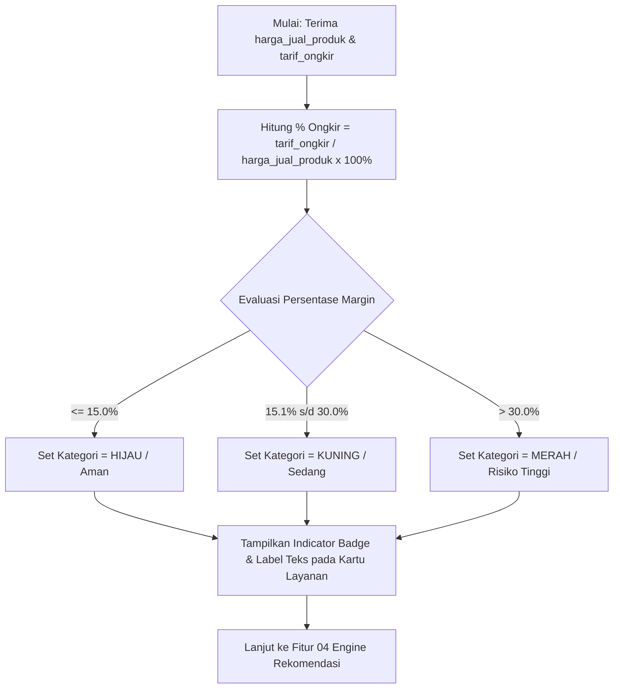

# Functional Requirements Document (FRD) v2
## Fitur 03: Kalkulator Margin Sederhana
**Proyek**: Anteraja Shipping Rate Calculator Optimization (MVP 2-Bulan)

---

### 1 · Konteks
Fitur ini menghitung rasio ongkos kirim terhadap harga jual produk dan memberikan indikator visual tingkat risiko margin bagi penjual. Fitur ini mengacu pada Bagian 4.A.3 dan Bagian 7 (P1 Must-Have) dalam `prd-shipping-rate-calculator-mvp-v3.md` untuk mentransformasi data tarif mentah menjadi wawasan profitabilitas bisnis (*Knowledge Layer*).

---

### 2 · Peran & Hak Akses

| Peran Pengguna | Lihat | Buat / Input | Ubah Input | Setujui | Field Terkunci (Read-Only) | Dikonfirmasi Ke |
| :--- | :---: | :---: | :---: | :---: | :--- | :--- |
| **Penjual UMKM (Public User)** | Ya | N/A | N/A | N/A | `persentase_ongkir`, `kategori_risiko_margin` (Auto-calculated) | Pemilik Proses |
| **Admin Pricing/Ops Anteraja** | Ya | Ya | Ya | Ya | N/A (Mengelola Threshold Margin) | Pemilik Proses |

---

### 3 · Alur (Workflow)

---

### 4 · Aturan Bisnis (Business Rules)

| No. BR | Kondisi / Trigger | Hasil / Perhitungan | Pengecualian | Dikonfirmasi Ke |
| :--- | :--- | :--- | :--- | :--- |
| **BR-07** | Formula Rasio Ongkir | $	ext{persentase\_ongkir} = (	ext{tarif\_ongkir} / 	ext{harga\_jual\_produk}) 	imes 100\%$, dibulatkan ke 1 desimal. | Jika $	ext{harga\_jual\_produk} = 0$ atau tidak diisi, persentase margin tidak ditampilkan. | Pemilik Proses |
| **BR-08** | Ambang Batas Warna Margin | - **Hijau (Aman)**: $\le 15.0\%$. ("Ongkir efisien, aman untuk profit"). - **Kuning (Sedang)**: $15.1\% - 30.0\%$. ("Ongkir lumayan, pertimbangkan subsidi ongkir"). - **Merah (Risiko)**: $> 30.0\%$. ("Ongkir mahal, berisiko pembatalan pesanan"). | Threshold bersifat global untuk MVP v1 (dapat disesuaikan di Open Decisions). | Pemilik Proses |

---

### 5 · Istilah (Glossary)

| Istilah Internal | Definisi & Arti Bisnis | Dikonfirmasi Ke |
| :--- | :--- | :--- |
| **Rasio Ongkir vs Harga** | Persentase porsi biaya pengiriman dibandingkan dengan harga jual produk yang ditawarkan penjual. | User tiap peran |
| **Risiko Margin** | Tingkat ancaman tergerusnya keuntungan penjual atau potensi batalnya pembeli akibat biaya pengiriman tinggi. | User tiap peran |

---

### 6 · Data Utama & Status

- **Daftar Field Utama**: `harga_jual_produk`, `tarif_ongkir`, `persentase_ongkir`, `kategori_risiko_margin` (`HIJAU` / `KUNING` / `MERAH`).
- **Status & Perpindahan State**:
  - `CALCULATING_MARGIN`: Sistem sedang menghitung rasio persentase.
  - `MARGIN_DISPLAYED`: Badge warna dan persentase sukses ditampilkan di kartu.

---

### 7 · Daftar Fungsi

1. **`F-03.1 Komputasi Rasio Margin`**: Menghitung porsi persentase biaya ongkir terhadap nilai harga jual produk.
2. **`F-03.2 Klasifikasi Risiko Visual`**: Menentukan kode warna (Hijau/Kuning/Merah) dan label tooltip berdasarkan batas persentase.

---

### 8 · Acceptance Criteria (AC) Alur Utama

- **Skenario Real**: Budi menjual Keripik seharga Rp 50.000.
- **Langkah & Hasil**:
  1. Opsi Reguler (Tarif Rp 24.000) -> Rasio = $(24.000 / 50.000) 	imes 100\% = 48.0\%$.
  2. Sistem mengidentifikasi $48.0\% > 30.0\%$ -> Kategori MERAH.
  3. Opsi Ekonomi (Tarif Rp 18.000) -> Rasio = $(18.000 / 50.000) 	imes 100\% = 36.0\%$ -> Kategori MERAH.
  4. Kartu Reguler menampilkan badge MERAH: "48.0% dari Harga Barang (Risiko Margin Tinggi)".
  5. Kartu Ekonomi menampilkan badge MERAH: "36.0% dari Harga Barang (Risiko Margin Tinggi)".

---

### 9 · Tidak Termasuk (Out of Scope)

- Penghitungan komisi komprehensif marketplace, pajak (PPN), atau HPP (*Cost of Goods Sold*).
- Rekomendasi penyesuaian harga jual produk otomatis.
