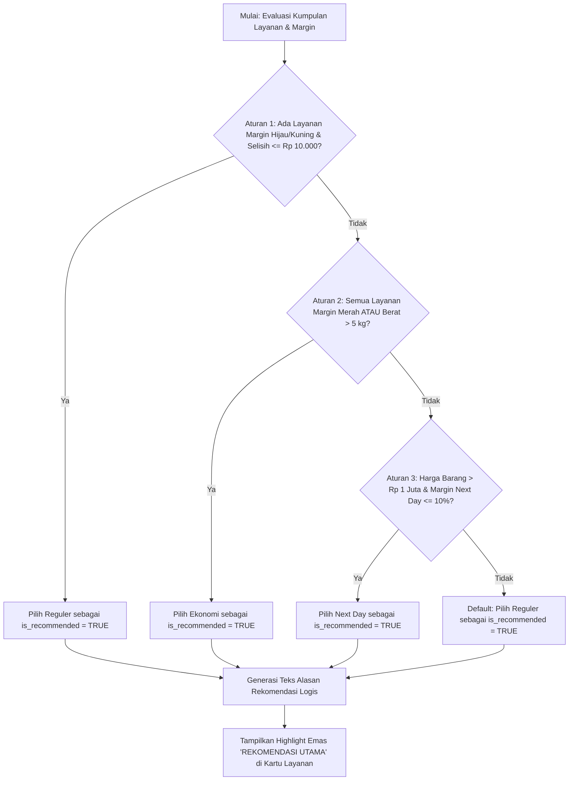

# Functional Requirements Document (FRD)
## Fitur 04: Engine Rekomendasi Berbasis Aturan (Rule-Based Wisdom)
**Proyek**: Anteraja Shipping Rate Calculator Optimization (MVP 2-Bulan)

---

### 1 · Konteks
Fitur ini bertindak sebagai mesin penentu saran otomatis (*Decision Support Engine*) yang memilih 1 layanan pengiriman terbaik dan memberikan 1 kalimat alasan logis (*Wisdom Layer*). Fitur ini merujuk pada Bagian 4.A.4 dan Bagian 7 (P1 Must-Have) dalam `prd-shipping-rate-calculator-mvp-v3.md` untuk menyederhanakan keputusan penjual secara instan.

---

### 2 · Peran & Hak Akses

| Peran Pengguna | Lihat | Buat / Input | Ubah Input | Setujui | Field Terkunci (Read-Only) | Dikonfirmasi Ke |
| :--- | :---: | :---: | :---: | :---: | :--- | :--- |
| **Penjual UMKM (Public User)** | Ya | N/A | N/A | N/A | `is_recommended`, `alasan_rekomendasi` (Read-only) | Pemilik Proses |
| **Admin Pricing/Ops Anteraja** | Ya | Ya | Ya | Ya | N/A (Mengelola Decision Tree Logic) | Pemilik Proses |

---

### 3 · Alur (Workflow)

---

### 4 · Aturan Bisnis (Business Rules)

| No. BR | Kondisi / Trigger | Hasil / Perhitungan | Pengecualian | Dikonfirmasi Ke |
| :--- | :--- | :--- | :--- | :--- |
| **BR-09** | Decision Tree Rekomendasi | **Aturan 1**: Margin $\le 30\%$ & Delta $\le 	ext{Rp } 10.000 
ightarrow$ **Reguler**. **Aturan 2**: Margin Merah ($>30\%$) ATAU Berat $>5	ext{ kg} 
ightarrow$ **Ekonomi**. **Aturan 3**: Harga $> 	ext{Rp } 1	ext{ Juta}$ & Margin Next Day $\le 10\% 
ightarrow$ **Next Day**. **Aturan Default**: Pilih **Reguler**. | Tepat $1$ opsi layanan ditandai `is_recommended = TRUE`. | Pemilik Proses |
| **BR-10** | Teks Alasan Rekomendasi | Dihasilkan dinamis (1-2 kalimat) menjelaskan *trade-off* hemat harga vs kecepatan SLA. | Teks bersifat deterministik berdasarkan *rule code* yang aktif. | Pemilik Proses |

---

### 5 · Istilah (Glossary)

| Istilah Internal | Definisi & Arti Bisnis | Dikonfirmasi Ke |
| :--- | :--- | :--- |
| **Wisdom Layer** | Tingkat tertinggi kerangka DIKW di mana sistem memberikan saran keputusan bisnis (*actionable recommendation*). | User tiap peran |
| **Trade-off Analysis** | Analisis perbandingan seimbang antara biaya ongkir yang dikeluarkan dan kecepatan pengiriman yang didapat. | User tiap peran |

---

### 6 · Data Utama & Status

- **Daftar Field Utama**: `is_recommended` (`TRUE`/`FALSE`), `alasan_rekomendasi`, `rule_code_applied`.
- **Status & Perpindahan State**:
  - `EVALUATING_RULES`: System sedang mengevaluasi kondisi *decision tree*.
  - `RECOMMENDED_SET`: 1 Layanan terpilih dan teks alasan sukses dirender.

---

### 7 · Daftar Fungsi

1. **`F-04.1 Evaluator Decision Tree`**: Menjalankan pengecekan aturan logika kondisional secara berurutan.
2. **`F-04.2 Generator Teks Alasan`**: Menyusun kalimat penjelasan logis berbasis variabel selisih harga dan SLA.

---

### 8 · Acceptance Criteria (AC) Alur Utama

- **Skenario Real**: Budi (Harga Barang Rp 50.000, Reguler Rp 24.000 [48%], Ekonomi Rp 18.000 [36%], Next Day Rp 36.000 [72%]).
- **Langkah & Hasil**:
  1. Engine mengevaluasi Aturan 1: Tidak ada layanan dengan margin $\le 30\%$.
  2. Engine mengevaluasi Aturan 2: Seluruh layanan berwarna MERAH ($>30\%$).
  3. Aturan 2 terpenuhi $
ightarrow$ Sistem memilih **Ekonomi** sebagai `is_recommended = TRUE`.
  4. Generator teks menghasilkan alasan: *"Layanan Ekonomi direkomendasikan untuk menekan rasio ongkir yang tinggi, menghemat Rp 6.000 (25%) dibanding Reguler"*.
  5. Kartu Ekonomi tampil di posisi teratas dengan badge emas "REKOMENDASI UTAMA".

---

### 9 · Tidak Termasuk (Out of Scope)

- Algoritma Machine Learning / AI Generatif dinamis.
- Personalisasi berbasis profil individu pengguna tanpa aturan statis.
